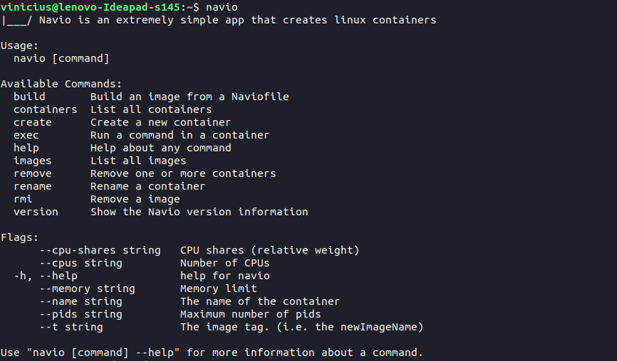

# Navio

   


**Navio** is a simple tool for creating and managing linux containers.

A container is **a set of processes isolated by Linux namespaces**. We use, for example, **PID** namespace to isolate the PID number space, **UTS** to isolate the hostname and **MOUNT** to isolate the filesystem mount points.

All containers have their own **rootfs** (a isolated "mini operating system") associated, so that a change (for example, an installation of any library or a creation of a file) in a container does not affect others ones.

It is also possible use `Cgroups` to limit the amount of resources that each container can use.

### Why?
For study purposes only

## Available Default Images

| Image| version| size |
| ---- | -----| ------|
| alpine|  v3.11| 2.7M|
| busybox| v4.0| 1.5M|
| ubuntu| v20.04| 90M|

## Demo


## [Namespaces](https://en.wikipedia.org/wiki/Linux_namespaces)

what the processes can see

- [x] UTS - isolate **hostname and domainname**

- [x] PID - isolate the **PID number space**

- [x] MNT - isolate **filesystem mount points**

## [Cgroups](https://www.kernel.org/doc/Documentation/cgroup-v1/cgroups.txt)

what the processes can use

- [x] Memory

- [x] CPU

- [x] Process numbers


## Available Commands 




## How to use

To create a basic container just type:

`sudo navio create ubuntu bash`

But you can use some flags, ex:

`--name ubuone` to define the name of container

`--pids 25`  to limit the maximum number of processes that the container can create

`--cpus 0-3` to limit the cpu cores that the container can use. For example, in this case (0-3) if you computer have at least 4 cores, **this flag will permit that the process of container use only 4 cores, no more**

`--cpus-share 100`

`--memory 1G`  to limit the maximum memory **RAM** that the container can use

### Limiting the container to use only 4 cpu cores


### Building new Images

 To build a image you need first create a [Naviofile](./Naviofile) with the base image and the commands. see a example:


## Limitations

- The network is not being isolated and is only working on the **ubuntu** image.
- The Navio does not allow containers to run in the background.
- The Navio does not limit the use of I/O

## Requirements

- **linux.** Navio's doesn't support other operational system :(
- [golang environment](https://golang.org/)
- make
- wget
- **mysql** configured with the root password == `root`
- some of commands (ex.: `navio build`, `navio create`, `navio rmi` and `navio exec`) must be executed with sudo privilegies.

## How to install

#### If you just want use, is very simples

``` bash
 git clone https://github.com/viniciusbds/navio.git
 cd navio
 ./install.sh
```

#### If you want compile the code before install

``` bash
 git clone https://github.com/viniciusbds/navio.git
 cd navio
 make
 ./install.sh
```

#### To run all unit tests, type

``` bash
 cd /path/to/project/navio
 sudo make unit-tests
```

#### To uninstall

``` bash
 cd navio
 ./uninstall.sh
```
  
## Example Commands

`navio images`

`sudo navio create ubuntu bash --name mycontainer`

`navio containers`

```
ID	   NAME	   	   IMAGE  	COMMAND  	STATUS

14806622   mycontainer     ubuntu  	bash  		Stopped

```

`sudo navio exec 14806622 bash` 

...

`sudo navio create busybox sh`

`sudo navio create alpine /bin/sh --name levezin`

## Contributing

You can contribute to the project in any way you want, either by fixing bugs, implementing new features, improving the documentation or proposing new features through issues

See [Contributting](/CONTRIBUTING.md) for more details

## References

- [Containers from Scratch • Liz Rice](https://www.youtube.com/watch?v=8fi7uSYlOdc)
  
- [Containers from Scratch](https://ericchiang.github.io/post/containers-from-scratch/)
  
- [Building a container with less than 100 lines in Go](https://www.infoq.com/br/articles/build-a-container-golang/)

- [Linux Namespaces](https://medium.com/@teddyking/namespaces-in-go-basics-e3f0fc1ff69a)
  
- [Namespaces](https://escotilhalivre.wordpress.com/2015/08/12/namespaces/)

- [Understanding Containerization By Recreating Docker](https://itnext.io/linux-container-from-scratch-339c3ba0411d)

- [Doqueru kun](https://github.com/joseims/doqueru-kun)
  
- [Icon](./cargueiro.png) made by [Freepik](https://www.flaticon.com/br/autores/freepik) from [www.flaticon.com](https://www.flaticon.com/br/)
